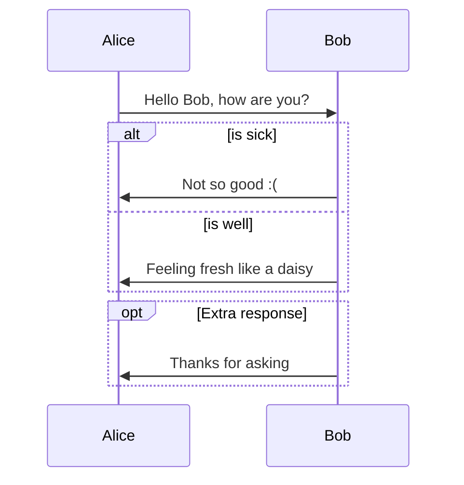
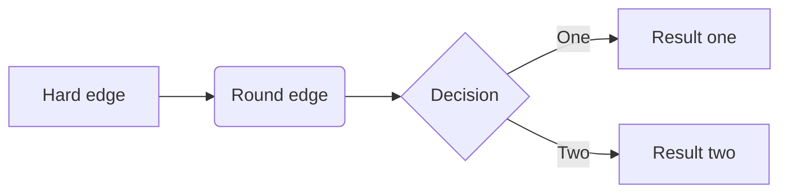

# [Draw Diagrams with Markdown](https://support.typora.io/Draw-Diagrams-With-Markdown/)


## Sequence Diagrams

```sequence
Alice->Bob: Hello Bob, how are you?
Note right of Bob: Bob thinks
Bob-->Alice: I am good thanks!
```

## Flowcharts

```flow
st=>start: Start
op=>operation: Your Operation
cond=>condition: Yes or No?
e=>end

st->op->cond
cond(yes)->e
cond(no)->op
```

## [Mermaid](https://mermaid.js.org/config/Tutorials.html)

### [Sequence Diagrams](https://mermaid.js.org/syntax/sequenceDiagram.html)



### [Flowcharts](https://mermaid.js.org/syntax/flowchart.html)


